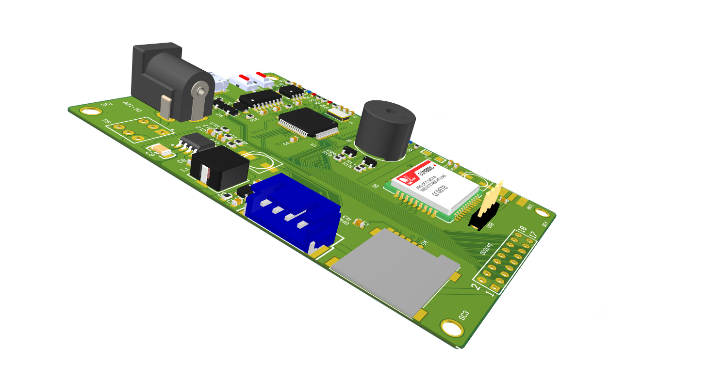

# STM32-OV2640-sim800-GPRS-图传

## 1 简介
底板是STM32和SIM800C集成在一起的一个板子，摄像头是以个以OV2640的CMOS模组，摄像头的有20PIN和18PIN两种，无论是哪种，请将摄像头和板子上的插座左对齐，然后插入。
板子供电为5V-12V DC，推荐使用12V/2A的适配器，如果使用劣质的适配器，可能导致GPRS模块工作不稳定，或注册网络失败等问题，电压过高可能导致板子上器件的烧毁。本板出售时不配带电源适配器，需要自行准备。
板子上有STM32F103RCT6单片机，FLASH容量256KB，RAM容量64KB，用户可以自己开发；板子上有LM75温度传感器，接口为IIC，提供例程，用户也可以自行开发温度上传程序等等，板子上有SIM800C GPRS模块，用户可以用该模块来打电话，发送或接收短信，该模块支持TCP、UDP、HTTP、MQTT等网络协议，用户可以二次开发。配带的OV2640摄像头可以输出JPEG、YUV、RGB等格式的图像数据，摄像头接口兼容原子的18引脚的OV2640摄像头模块。用户可以将配带的摄像头用在其他板子上。
## 2 烧录
板子上使用的串口芯片为国产的CH340，可以通过百度进行下载也可以通过驱动人生等软件进行自动安装，如果存在问题，请联系技术支持获得软件包或者远程协助。
板子的左侧4PIN白色端子为SWD烧录接口，可以接STlink或者Jlink，板子上的USB转串口接在单片机的UART1上，暂时只能传输串口数据，不可进行串口烧录。
